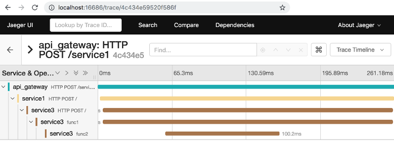

# ginopentracing

[](https://opensource.org/licenses/MIT)

Gin middleware for open tracing.

Download:

```shell
$ go get -u github.com/10gic/opengtracing-gin
```

See https://github.com/opentracing/opentracing-go for more information

## Usage

For example you have architecture like this


For request `curl -X POST http://localhost:8000/service1`, the tracing result like this



# Run jaeger
Install and run jaeger all-in-one docker image:
```shell
$ docker run -d --name jaeger \
  -e COLLECTOR_ZIPKIN_HTTP_PORT=9411 \
  -p 5775:5775/udp \
  -p 6831:6831/udp \
  -p 6832:6832/udp \
  -p 5778:5778 \
  -p 16686:16686 \
  -p 14268:14268 \
  -p 9411:9411 \
  jaegertracing/all-in-one:1.12
```

Open http://localhost:16686 for Jaeger UI.

# Reference
https://github.com/gin-contrib/opengintracing/tree/master/example
